# NixOS ThaigerSprint 2025

{ width="200" }

*What*

:    A week of intense hacking [on Nix](https://nix.dev) in Thailand.

*When*          
:    10/11/2025 - 17/11/2025 (Mon - Mon)  

*Where*
:    [Chiang Mai, Thailand](https://maps.app.goo.gl/fPWbJqoz32Hisu3R9)

*Who* 
:    ~30 developers.

## 📍 Location

[Chiang Mai, Thailand](https://maps.app.goo.gl/fPWbJqoz32Hisu3R9)

## Pictures from last ThaigerSprint

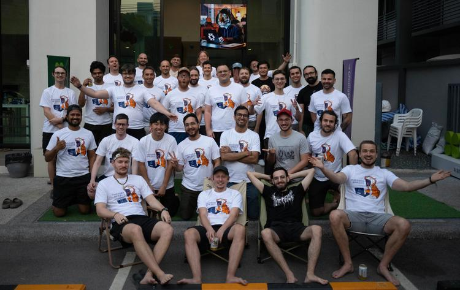
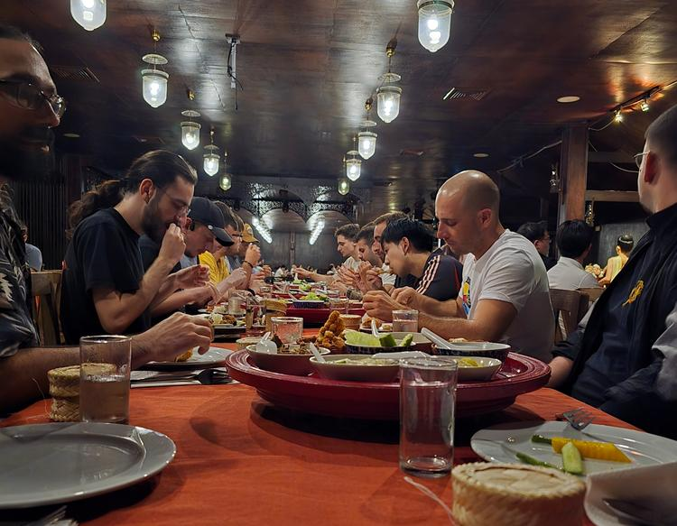
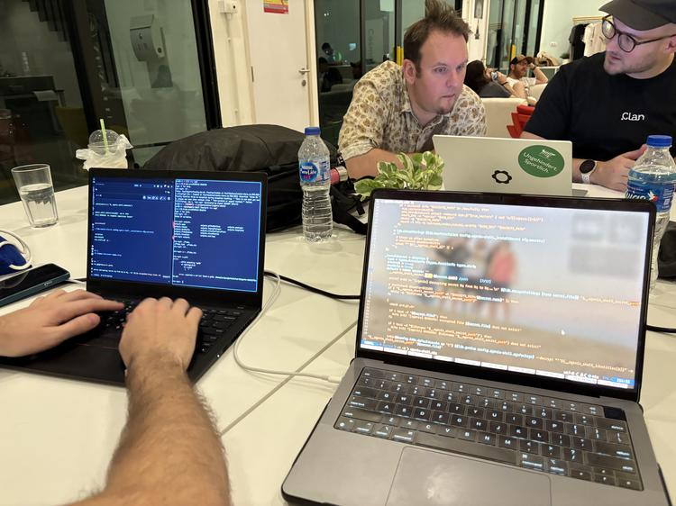
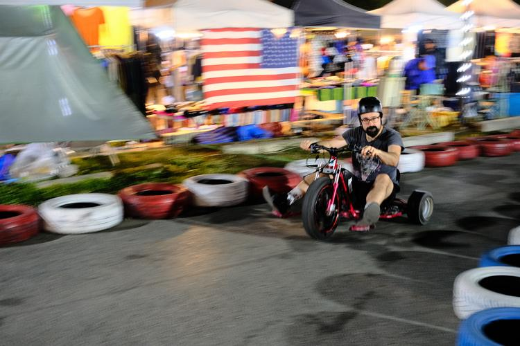
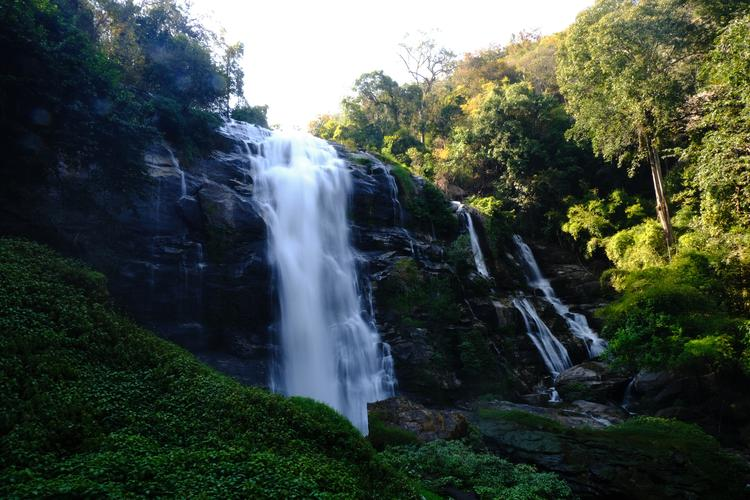
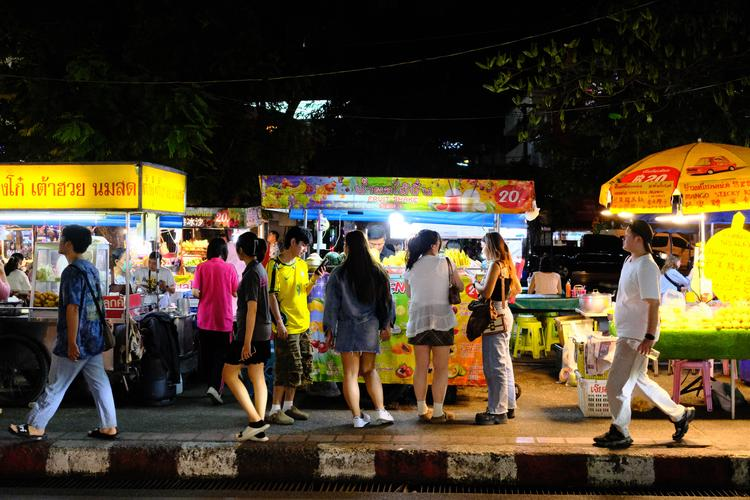
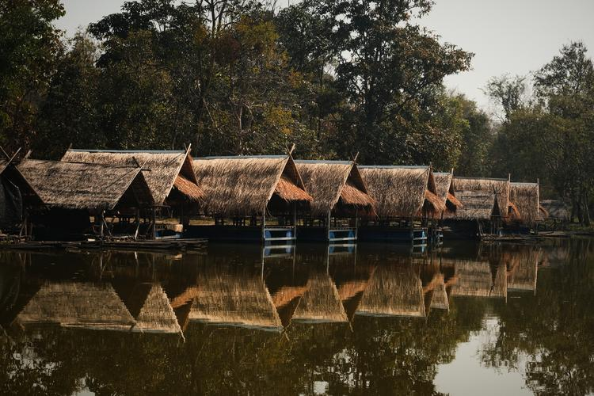
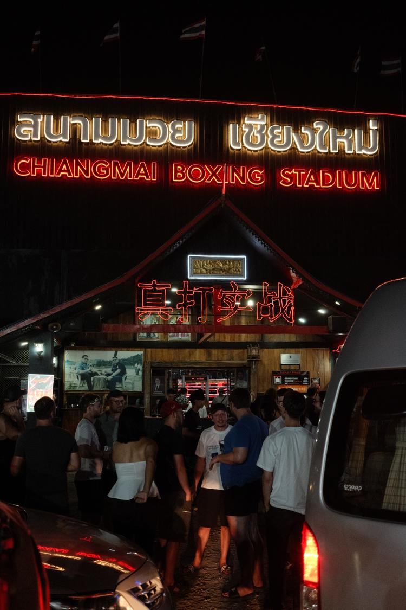
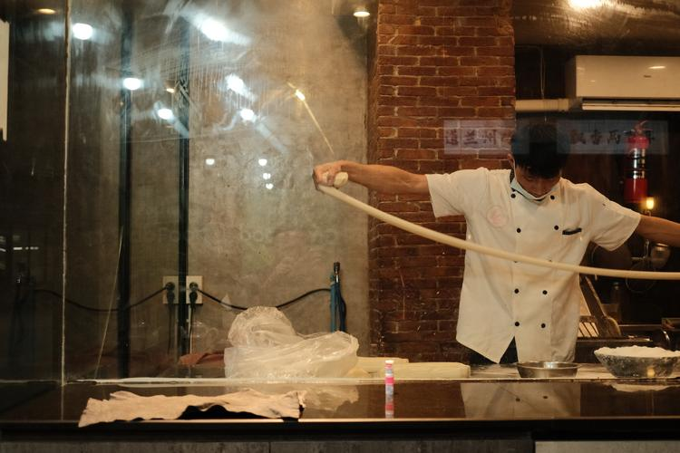
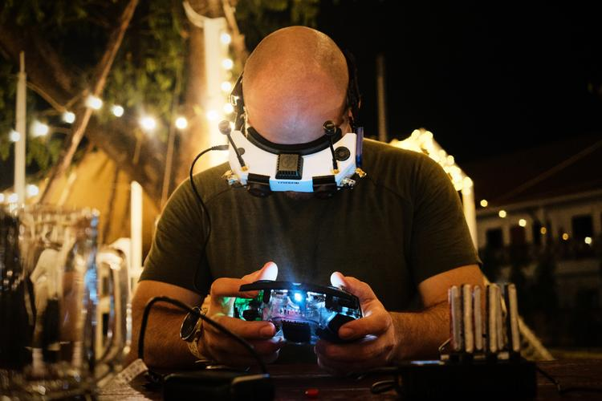
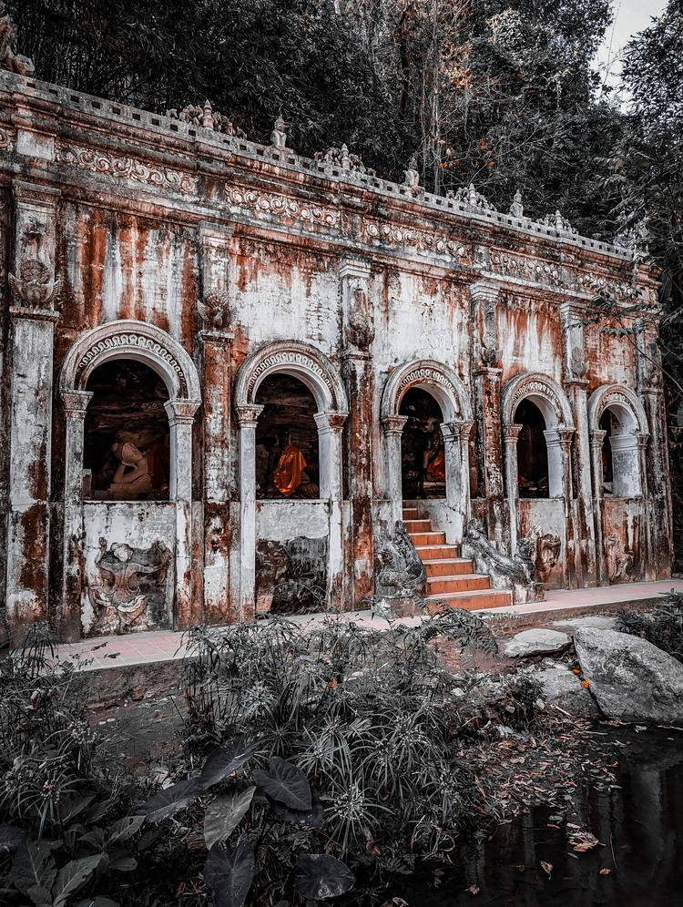

## 🏘️ Accommodation

This time the sprint will be at a resort 30 minutes outside of Chiang Mai.

The costs per Room for the whole duration are: **13550 THB ~ 360 EUR ~ 417 USD**

The costs can be split if multiple people want to share a room (Select preferences in application).

If you come earlier, make sure to book your other accommodation ahead of time.
The Loi Kratong Festival will take place in Chiang Mai just a few days before the sprint.
Around this time the city will be booked out. Last minute booking is not an option.

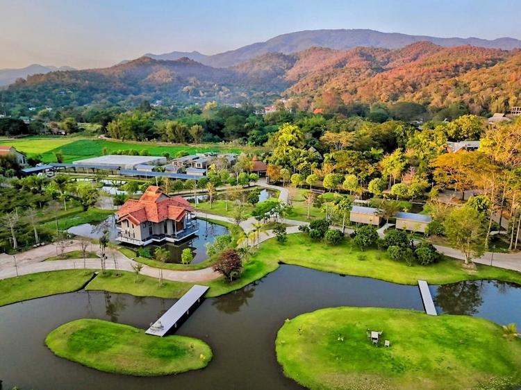

## 🍲 Food

We'll organize catering (breakfast + lunch) during the sprint, which is sponsored

## 🔥 Application

[Fill out the form to apply](https://cryptpad.fr/form/#/2/form/view/fRNxfk64AEt-fd1vAKq2laqNvCjXNeTPv2HIDk-7Vu4/).

<!-- Registration closed.
You'll be notified soon if you're part of the sprint. -->

## 🧵 Topics

To be determined once registration closes based on attendees interest.

## 🛬 How to get here

### Quickest
For people coming from outside Asia, the quickest way to get to Chiang Mai is by plane, usually with layover in Bangkok.

### Cost Efficient
Domestic flights in Thailand are relatively inexpensive, starting from as low as 25$.

In some cases it migth be cheaper to book a flight to Bangkok and then continue to Chiang Mai via a separate domestic flight, or via the night train which is a nice experience for many travelers.

## 🥳 Stuff to do in Chiang Mai

- Thai Cooking Lessons
- Night Markets
- Temples
- Mountain Biking
- Jungle Trekking
- Elephant Sanctuary
- Yoga
- Thai Boxing training session
- Watch Thai Boxing Fight
- Thai Massage
- Rafting
- Waterfalls
- ATV
- Water Parks
- Guided city tour
- Karaoke

<!-- See [Activities](./activities.md) for the full list. -->

## 💙 Sponsors

We're looking for sponsors to cover expenses such as venue, catering, T-shirt printing and some of the activities.

Please help us make this a productive event by chipping in, so we can focus on coding instead of grocery shopping and cooking.

Our target budget is 10000 EUR. Reach out to [sponsors@thaigersprint.org](mailto:sponsors@thaigersprint.org).

| Level      | Contribution (EUR) | Perks                        |
|------------|--------------------|--------------------------------------------------------------------------------------------|
| Gold       | 4000               | Company + Large logo on the T-shirt, 2 total reserved seats, shoutout during dinner, SWAG. |
| Silver     | 1500               | Individual + Logo on the T-shirt, company name on name tag + 1 reserved seat.              |
| Individual | 500                | Logo on the website.                                                                       |

### 🏆 Gold
[{: style="width:200px; margin:20px"}](https://clan.lol)
<!-- {: style="width:400px; margin:20px"} -->

<!-- ### 🏢 Silver -->

<!-- {: style="width:400px; margin:20px"}
[{: style="width:400px; margin:20px"}](https://numtide.com) -->

<!-- ### 💻 Individual -->

<!-- {: style="width:400px; margin:20px"} -->

<!-- ## 🧑 Participants
- Adam Hoese
- David Hauer
- Domen Kožar
- espes
- Florian Friesdorf
- Florian Klink
- Fritz Otlinghaus
- Jacek Galowicz
- Jaka Hudoklin
- Johannes Kirschbauer
- lassulus
- Luis Hebendanz
- Marijan Petričević
- Matthew Croughan
- Michael Schneider
- Paul Harvey
- Peter Kolloch
- Phanupong Janthapoon
- Shahar "Dawn" Or
- toastal
- Vincent Ambo -->

## 🎖️ Organizers

- David Hauer, https://github.com/DavHau
