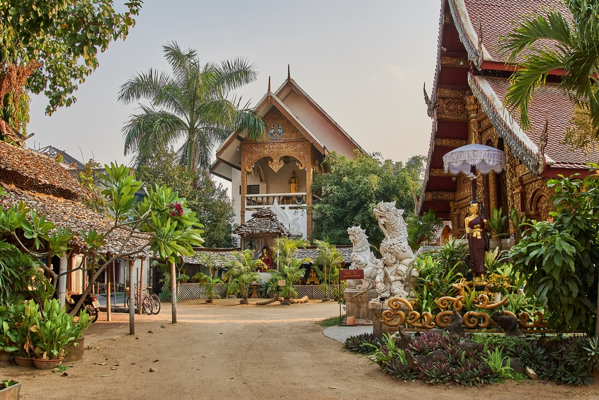
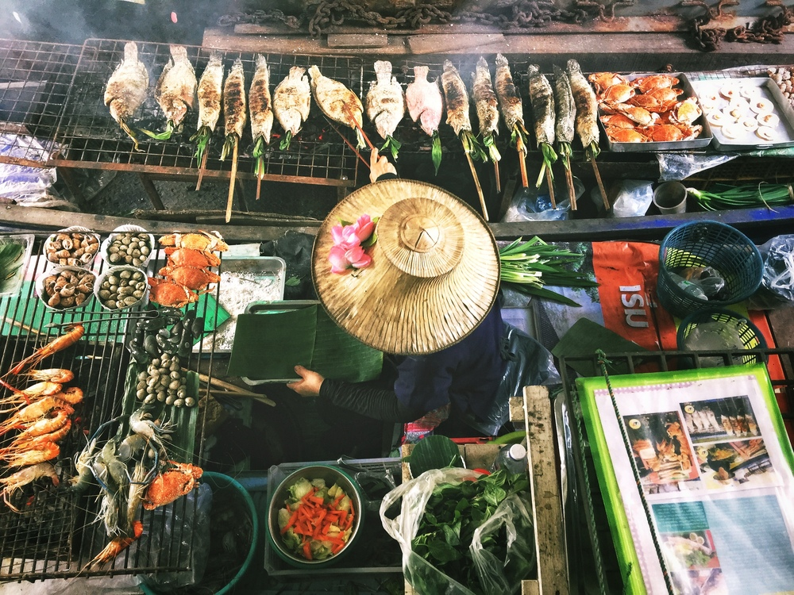
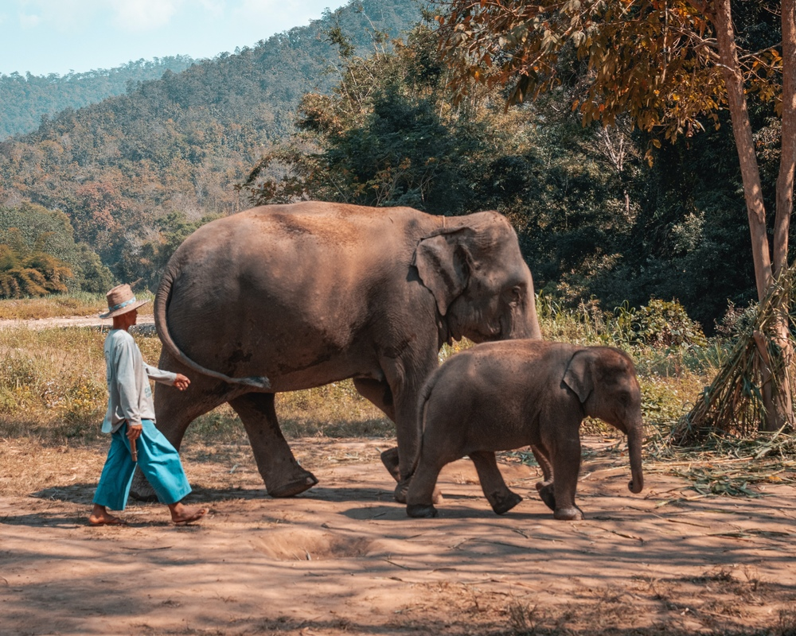
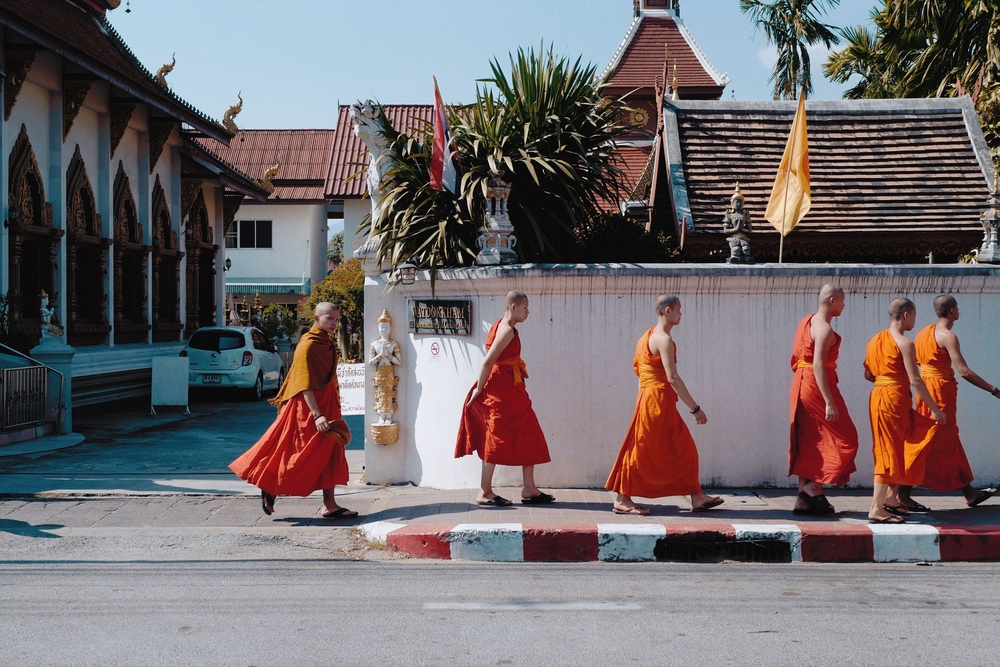
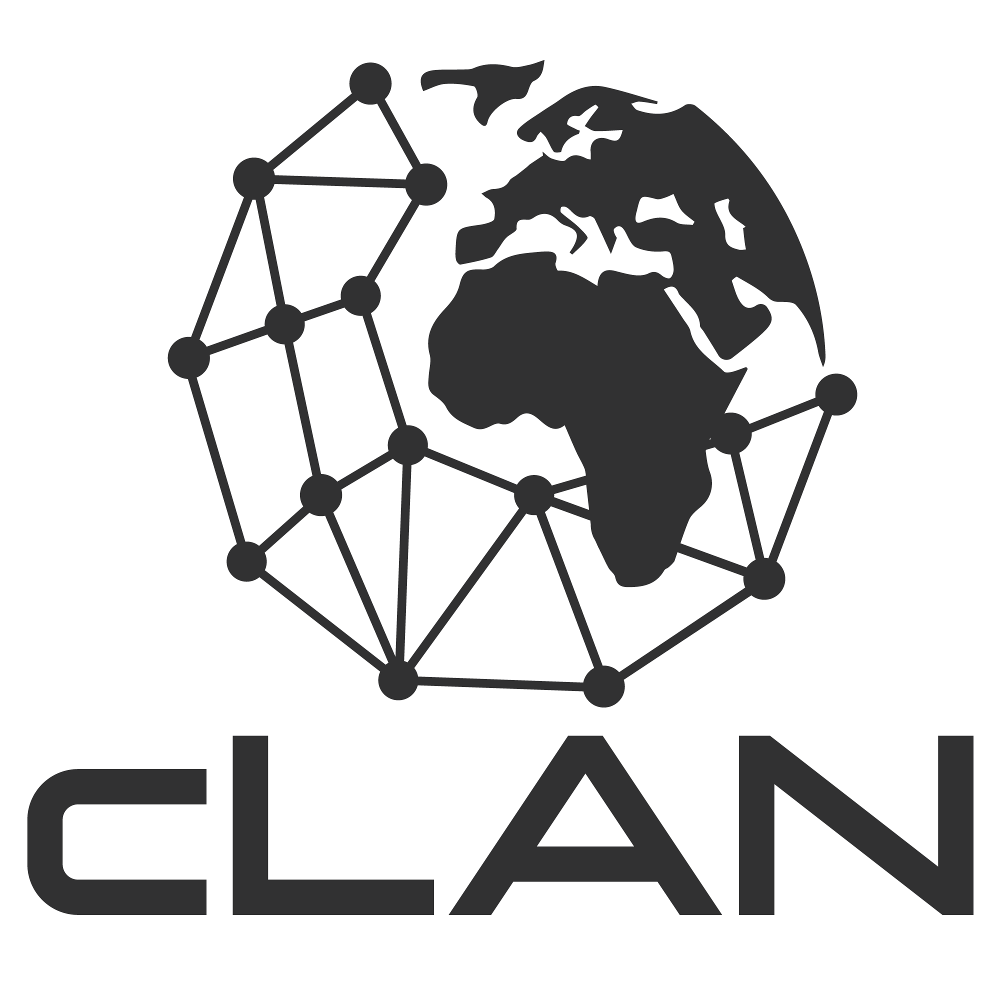

# NixOS Thaiger Sprint 2024

{ width="200" }

*What*

:    A week of intense hacking [on Nix](https://nix.dev) in Thailand.

*When*          
:    15/02/2024 - 22/02/2024 (Thu - Thu)  

*Where*
:    [Chiang Mai, Thailand](https://maps.app.goo.gl/fPWbJqoz32Hisu3R9)

*Who* 
:    ~20 developers.

## 📍 Location

[Chiang Mai, Thailand](https://maps.app.goo.gl/fPWbJqoz32Hisu3R9)

<!-- The sprint will take place outside under pavilion tents (for sunshine protection) in a villa with a pool.

Withing a 5 minute walk you can reach:

- one of the best beaches in Lanzarote, where you can swim, jog, snorkel, SUP, surf and windsurf,
- a local supermarket that is open every day from 8AM to 10PM,
- a pharmacy and a bakery,
- 5km long beachside promenade with free outside gyms,
- a steakhouse, a burger joint and an authentic Spanish tapas tavern,
- an assortment of other various cafes, pubs and bars, restaurants, etc. -->

## 🏘️ Accommodation

Once you are approved participant for the sprint, we'll get everyone to a shared communication room to help organize accommodation.

Note that the accommodation is not covered by the sprint budget.

<!-- If you are planning to come with your family and/or stay longer, [Nejc Zupan](https://twitter.com/nzupan) has written a [remote worker's guide to Lanzarote](https://github.com/zupo/awesome-lanzarote). -->

<!-- See [Accomodations](./accomodation.md) for a list of suggestions. -->

## 🍲 Food

We'll organize catering (breakfast and lunch) during the sprint, which is paid by the sponsors.

There are a ton of options for dinners in nearby restaurants.

## 🔥 Registration

<!-- [Fill out the form to apply](https://cryptpad.fr/form/#/2/form/view/EKsx9kFyCVf8sTGNziBRIuFascXwPsiw+xli5jr3Ago/). -->

Registration closed.
You'll be notified soon if you're part of the sprint.

## 🧵 Topics

To be determined once registration closes based on attendees interest.

## 🛬 How to get here

<!-- The best way to travel is [via a plane to Lanzarote airport](https://www.flightconnections.com/flights-to-lanzarote-arrecife-ace). 

It's also possible to fly to other island airports and then take a short flight. Fuertaventura is closest being 30min away with a ferry.

From the Lanzarote airport you can take a taxi to the venue, they have a flat rate and it should be around 20-25 EUR.

[Renting a car](https://autoreisen.com/) is usually quite cheap, around 100-150 eur for the week. -->

### Quickest
For people coming from outside Asia, the quickest way to get to Chiang Mai is by plane, usually with layover in Bangkok.

### Cost Efficient
Domestic flights in Thailand are relatively inexpensive, starting from as low as 25$.

Therefore it might be cheaper to just book a flight to Bangkok and then continue to Chiang Mai via a separate domestic flight, or via the night train which is a nice experience for many travelers.

## 🥳 Stuff to do in Chiang Mai

- Thai Cooking Lessons
- Night Markets
- Temples
- Mountain Biking
- Jungle Trekking
- Elephant Sanctuary
- Yoga
- Thai Boxing training session
- Watch Thai Boxing Fight
- Thai Massage
- Rafting
- Waterfalls
- ATV
- Water Parks
- Guided city tour
- Karaoke

<!-- See [Activities](./activities.md) for the full list. -->

## 💙 Sponsors

We're looking for sponsors to cover expenses such as venue, catering, T-shirt printing and some of the activities.

Please help us make this a productive event by chipping in, so we can focus on coding instead of grocery shopping and cooking.

Our target budget is 10000 EUR. Reach out to [sponsors@thaigersprint.org](mailto:sponsors@thaigersprint.org).

| Level      | Contribution (EUR) | Perks                        |
|------------|--------------------|--------------------------------------------------------------------------------------------|
| Gold       | 4000               | Company + Large logo on the T-shirt, 2 total reserved seats, shoutout during dinner, SWAG. |
| Company    | 1500               | Individual + Logo on the T-shirt, company name on name tag + 1 reserved seat.              |
| Individual | 500                | Logo on the website.                                                                       |

### 🏆 Gold

{: style="width:400px; margin:20px"}
<!-- {: style="width:400px; margin:20px"}
{: style="width:400px; margin:20px"}
{: style="width:400px; margin:20px"} -->

### 🏢 Company

{: style="width:400px; margin:20px"}
{: style="width:200px; margin:20px"}
<!-- {: style="width:250px; margin:20px"}
{: style="width:250px; margin:20px"}
{: style="width:250px; margin:20px"}
{: style="width:250px; margin:20px"}
{: style="width:250px; margin:20px"} -->

### 💻 Individual

- Florian Friesdorf
<!-- {: style="width:200px; margin:20px"}
{: style="width:200px; margin:20px"} -->

<!-- ## 🧑 Participants -->

## 🎖️ Organizers

- David Hauer, NixOS M♡dule System Lover
- Lassulus, long time contributor, maintainer of nixos-anywhere & disko 
- Domen Kožar, long time contributor to NixOS, organizer of Zidanca Sprint
- Nejc Zupan, recently converted NixOS evangelist, organizer of Sauna Sprint
<!-- - Florian Friesdorf, long time contributor to NixOS -->
