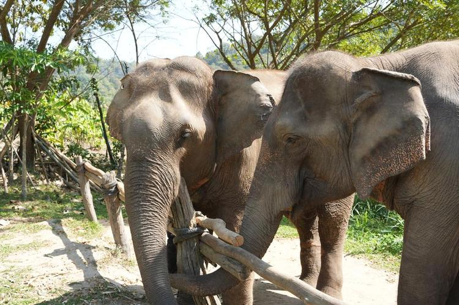
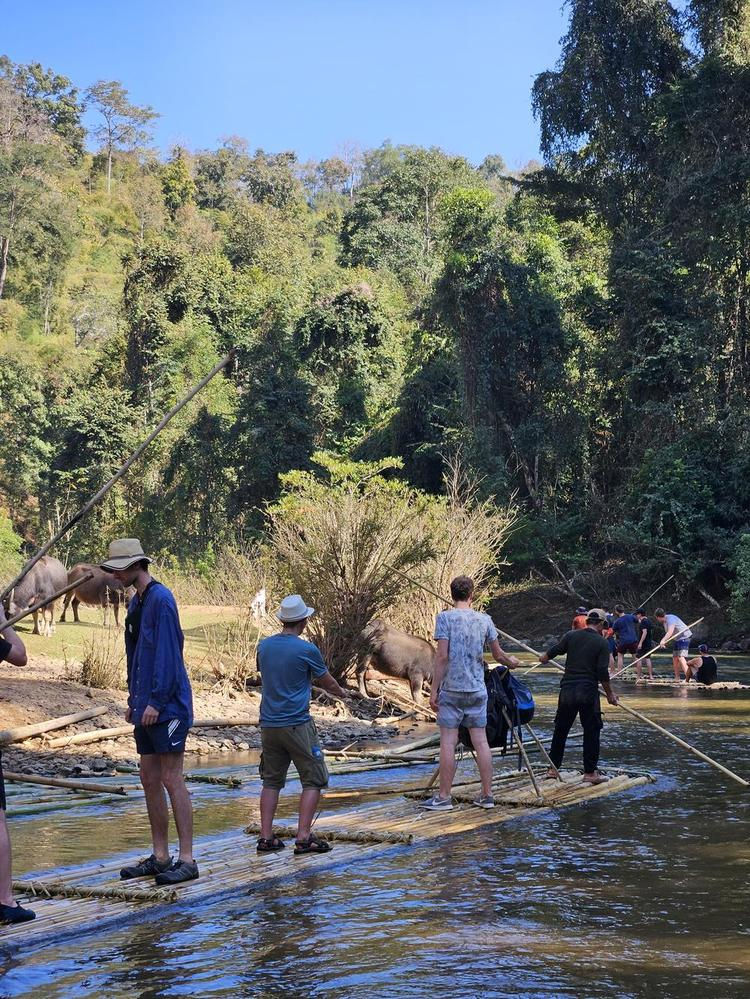
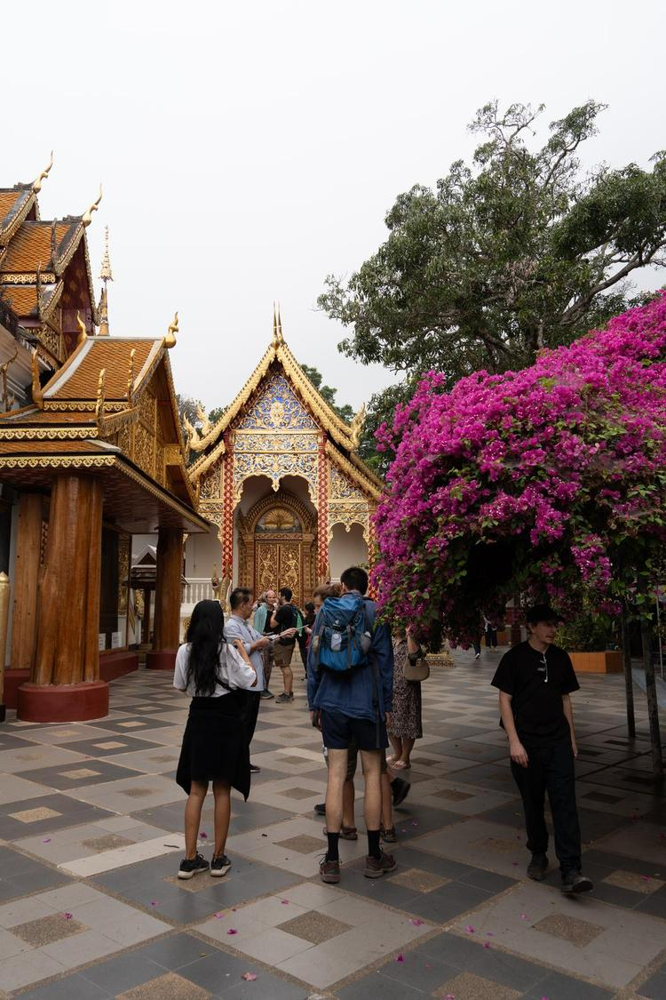
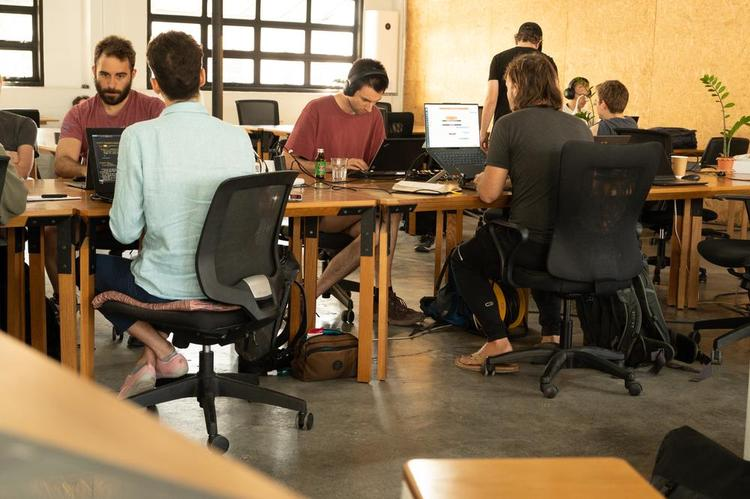
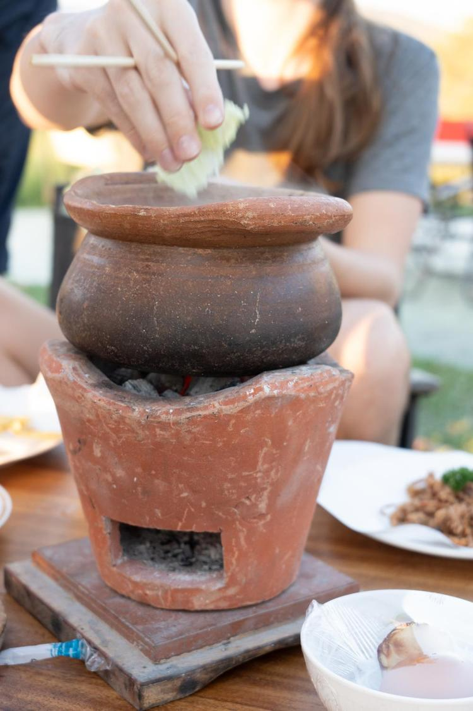
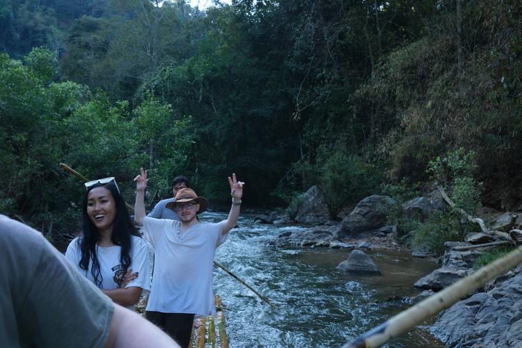
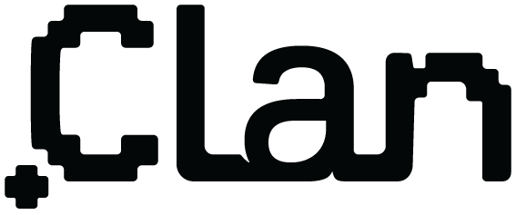

# NixOS Thaiger Sprint 2025

{ width="200" }

*What*

:    A week of intense hacking [on Nix](https://nix.dev) in Thailand.

*When*          
:    12/02/2025 - 19/02/2025 (Wed - Wed)  

*Where*
:    [Chiang Mai, Thailand](https://maps.app.goo.gl/fPWbJqoz32Hisu3R9)

*Who* 
:    ~30 developers.

## 📍 Location

[Chiang Mai, Thailand](https://maps.app.goo.gl/fPWbJqoz32Hisu3R9)

## 🏘️ Accommodation

Once you are approved participant for the sprint, we'll get everyone to a shared communication room to help organize accommodation.

Note that the accommodation is not covered by the sprint budget.

## 🍲 Food

We'll organize catering (lunch) during the sprint, which is sponsored

There are a ton of options for dinners in nearby restaurants.

## 🔥 Registration

[Fill out the form to apply](https://cryptpad.fr/form/#/2/form/view/lvlaI1ymgcdkBbMYtg880OmH7CvgbIIYmKoOQ4kEJWc/).

<!-- Registration closed.
You'll be notified soon if you're part of the sprint. -->

## 🧵 Topics

To be determined once registration closes based on attendees interest.

## 🛬 How to get here

### Quickest
For people coming from outside Asia, the quickest way to get to Chiang Mai is by plane, usually with layover in Bangkok.

### Cost Efficient
Domestic flights in Thailand are relatively inexpensive, starting from as low as 25$.

Therefore it might be cheaper to just book a flight to Bangkok and then continue to Chiang Mai via a separate domestic flight, or via the night train which is a nice experience for many travelers.

## 🥳 Stuff to do in Chiang Mai

- Thai Cooking Lessons
- Night Markets
- Temples
- Mountain Biking
- Jungle Trekking
- Elephant Sanctuary
- Yoga
- Thai Boxing training session
- Watch Thai Boxing Fight
- Thai Massage
- Rafting
- Waterfalls
- ATV
- Water Parks
- Guided city tour
- Karaoke

<!-- See [Activities](./activities.md) for the full list. -->

## 💙 Sponsored by

[{: style="width:200px; margin:20px"}](https://clan.lol)

<!-- We're looking for sponsors to cover expenses such as venue, catering, T-shirt printing and some of the activities.

Please help us make this a productive event by chipping in, so we can focus on coding instead of grocery shopping and cooking.

Our target budget is 10000 EUR. Reach out to [sponsors@thaigersprint.org](mailto:sponsors@thaigersprint.org).

| Level      | Contribution (EUR) | Perks                        |
|------------|--------------------|--------------------------------------------------------------------------------------------|
| Gold       | 4000               | Company + Large logo on the T-shirt, 2 total reserved seats, shoutout during dinner, SWAG. |
| Company    | 1500               | Individual + Logo on the T-shirt, company name on name tag + 1 reserved seat.              |
| Individual | 500                | Logo on the website.                                                                       | -->

<!-- ### 🏆 Gold -->

<!-- {: style="width:400px; margin:20px"} -->

<!-- ### 🏢 Company -->

<!-- {: style="width:400px; margin:20px"}
[{: style="width:200px; margin:20px"}](https://clan.lol)
[{: style="width:400px; margin:20px"}](https://numtide.com) -->

<!-- ### 💻 Individual -->

<!-- {: style="width:400px; margin:20px"} -->

<!-- ## 🧑 Participants
- Adam Hoese
- David Hauer
- Domen Kožar
- espes
- Florian Friesdorf
- Florian Klink
- Fritz Otlinghaus
- Jacek Galowicz
- Jaka Hudoklin
- Johannes Kirschbauer
- lassulus
- Luis Hebendanz
- Marijan Petričević
- Matthew Croughan
- Michael Schneider
- Paul Harvey
- Peter Kolloch
- Phanupong Janthapoon
- Shahar "Dawn" Or
- toastal
- Vincent Ambo -->

## 🎖️ Organizers

- David Hauer, https://github.com/DavHau
